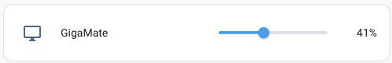

# GigaMate

This pet project is a tray utility for macOS built with [Electron](https://www.electronjs.org/), designed to control a capable Gigabyte monitors.  
The application provides a simple interface to adjust brightness. 


## Features


- **Tray Icon**: Access the utility from the macOS tray.
- **Monitor Control**: Adjust brightness.
- **Global Shortcuts**: Use keyboard shortcuts to adjust brightness.
- **Startup**: Runs app login.
- **Express Server**: Control the monitor settings via HTTP requests, for example from [HomeAssistant](https://www.home-assistant.io/).


## Capable models*

* Gigabyte M32Q
* Gigabyte M32U _(not confirmed)_
* Gigabyte M28U _(not confirmed)_

_* Probably all Gigabyte monitors that uses a Realtek HID device to control it over OSD sidekick should have the same protocol_

## Installation

1. **Clone the repository**:
    ```bash
    git clone https://github.com/DmitryBoiadji/GigaMate
    cd GigaMate
    ```

2. **Install dependencies**:
    ```bash
    npm install
    ```

3. **Run the application**:
    ```bash
    npm start
    ```

## Usage

### Global Shortcuts

- **Increase Brightness**: `Alt+CommandOrControl+Shift+=`
- **Decrease Brightness**: `Alt+CommandOrControl+Shift+-`
- 
### Tray Menu

- **Quit**: Exit the application.


### HTTP API

The application runs an Express server on port `3000` to accept HTTP requests for monitor settings.

- **Set Brightness**:
    ```http
    POST /monitor-settings
    Content-Type: application/x-www-form-urlencoded

    brightness=<value>
    ```
HomeAssistant rest example can be found [here](hass/rest.yaml).  




## TO-DO

Add issues with links


## Contributing

Feel free to fork the repository and submit pull requests. For major changes, please open an issue first to discuss what you would like to change.

## License


## Special thanks

Mention kelvie is a must!

https://github.com/kelvie/gbmonctl


## Acknowledgements

- [Electron](https://www.electronjs.org/)
- [Node-HID](https://github.com/node-hid/node-hid)
- [Express](https://expressjs.com/)

---

